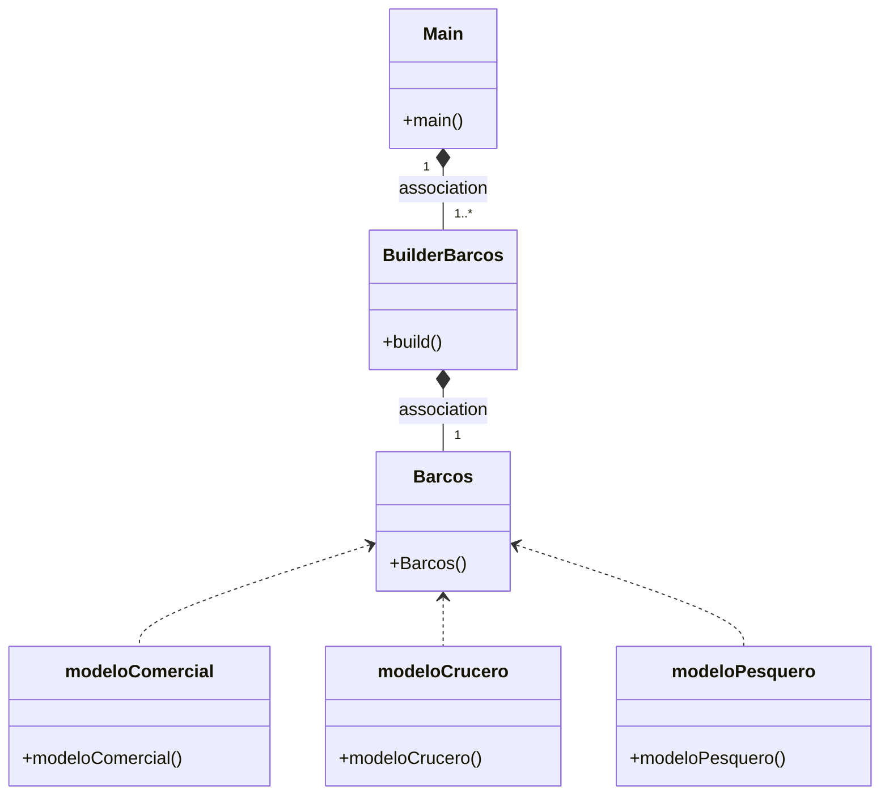

## EXAMEN FACTORY E BUILDER

----------------------------------------------------------

#### ¿Cual es la función del patrón builder?

O patrón Builder é un patrón de deseño creacional que se utiliza para construír obxectos complexos paso a paso e permitir a creación de diferentes tipos e representacións de obxectos co mesmo proceso de construción.

A función principal do patrón Builder é separar a construción dun obxecto complexo da súa representación, de maneira que o mesmo proceso de construción poida crear diferentes representacións dun obxecto.

Un exemplo seria unha clase Barco, cos seus respectivos valores tanto si e para uso pesqueiro, turistico, personal entre moitos. Ao utilizar o patrón Builder podemos personalizar cada tipo dos sabendo o uso dos barcos co color, dimension, motor.

-----
 
#### ¿Como es su Diagrama de clases de este ejemplo que has hecho? Realiza en el readme el diagrama

------

#### ¿Podríamos combinarlo con el patrón Factory? Explícalo con algo de código como lo harías

Para empezar si e posible combinar ambos patróns, facendo así que sexa mais fácil crear obxectos. O que faria seria usar o Patrón Factory para crear instancias de builders, e usar os Builders para crear os obxectos.

public class Factory{
    public static Builder crearBuilder(){
        return new Builder();
    }
}
public class Cliente {
    public static void main(String[] args) {
        Builder builder = Factory.crearBuilder();
        builder.buildPartA();
        builder.buildPartB();
        Product product = builder.getResult();
}
}